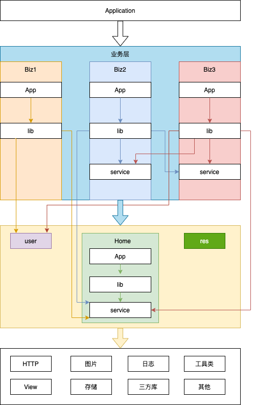

# Android SPI Demo

本项目是 Android SPI 项目的一个 Demo ，同时也是一次对 Android 模块化的探索。


在我个人的理解中，业务模块需要功能模块的支撑。例如，对于一个电商类的应用来说，商品、订单、用户等功能属于业务模块，HTTP 、图片加载等属于功能模块。


一个项目进行组件化构建时，需要将所有的业务逻辑拆分为一个个独立的模块，并且以 Library 项目的形式展示。在开发阶段，每一个模块都有一个对应的空壳应用项目，用于进行该模块的开发；在打包阶段，每一个模块需要加入主项目的依赖，以实现将所有模块打包入主项目。


使用模块化构建项目时，一定会遇到两个问题：

1. 主项目怎么获取子模块中的实现类

   主项目获取子模块中的实现类的目的一般是：为了实现各个模块的加载以及 Application 的生命周期的传递。随着业务的发展，单独业务逻辑的模块会越来越多，如果每增加一个模块，就需要在主项目中手写代码加载对应的模块将会是一件很麻烦的事情。

2. 同级模块之间怎么交互

   模块之间的交互主要就是页面的跳转和数据的传递。

   页面跳转可以通过隐式 Intent 实现，也可以使用三方的 router 类的库实现。

   数据的传递则会引发更多的问题：为了扩展性和便利性，模块间传递数据时，更多的是使用 xml 、json 等格式化数据。这种做法有两个问题：

   1. 数据传递过程中，需要进行一次序列化和一次反序列化，造成性能损耗。
   2. 数据传递的双方将各自持有一个格式化数据对应的 Java Bean（字段相同，但是类名或者包名不同），造成类数量无意义地增加。 

   倘若两个模块间直接传递 Java Bean 则不会出现以上两个问题，但是这个 Java Bean 由哪一个模块创建将会是一个很大的问题。

   1. 若由子模块创建，则若出现两个子模块相互传递数据的情况，则会出现循环依赖的问题，导致项目无法编译。
   2. 若由公共模块创建，则每两个子模块需要传递数据就需要公共模块添加代码，一则公共模块代码会越来越大，二则公共模块的开发人员需要听候子模块开发人员需求，导致开发效率降低。


在微信团队发表的文章[微信Android架构历史](https://mp.weixin.qq.com/s/6Q818XA5FaHd7jJMFBG60w)中，提到了一种模块化的解决思路，我也是借鉴了微信团队的模块化的思路，写了 Android SPI 以实现上述两个问题的具体实现方案。同时为了验证这个解决方案，写了本项目加以验证。


```
android-spi-demo
├─Application
│  └─app
├─Base
│  ├─res
│  └─user
├─Biz1
│  ├─app
│  └─lib
├─Biz2
│  ├─app
│  ├─lib
│  └─service
├─Biz3
│  ├─app
│  ├─lib
│  └─service
└─Home
    ├─app
    ├─lib
    └─service
```




Application 项目为主项目，它包含一个空壳项目 app ，不包含任何代码。它依赖了 Biz1 、Biz2 、Biz3 三个模块。


Base 为公共模块，用以向所有的业务模块提供基础支持和全局的数据支持。它包含两个项目，其中  user 向所有的业务模块提供了 UserManager 类，用以管理用户信息；res 为公共模块，用以向所有的业务模块提供基础的资源文件和样式。


Home 模块为架构支持层，用户在首页展示各个业务模块。其中，lib 为具体的实现层；service 为接口定义层。所有需要在首页展示的业务模块，均需要依赖 service 层，并实现接口。


Biz1 为一个具体的业务模块，它和其他业务模块没有任何交互，只依赖了 user 模块。Biz1 中包含两个项目，其中 app 项目为 Biz1 模块单独的应用项目，它是一个空壳项目，仅生成应用，加载 Biz1 模块的页面，用于 Biz1 模块的单独开发；lib 为 Biz1 具体的业务项目，所有 Biz1 的逻辑代码都在这里。


Biz2 为一个具体的业务模块，它依赖 Biz3 模块的 service 。Biz2 中包含三个项目，其中 app 项目为 Biz2 模块单独的应用项目，它是一个空壳项目，仅生成应用，加载 Biz2 模块的页面，用于 Biz2 模块的单独开发；lib 项目为 Biz2 具体的业务项目，所有 Biz2 的逻辑代码都在这里；service 项目为 Biz2 的接口定义层，它包含了这个 Service 的定义和相关的 Java Bean 。其他需要使用 Biz2 提供服务的业务模块，都可以依赖该 service 项目。


Biz3 为一个具体的业务模块，它依赖 Biz2 模块的 service 。Biz3 中包含三个项目，其中 app 项目为 Biz3 模块单独的应用项目，它是一个空壳项目，仅生成应用，加载 Biz3 模块的页面，用于 Biz3 模块的单独开发；lib 为 Biz3 具体的业务项目，所有 Biz3 的逻辑代码都在这里；service 项目为 Biz3 的接口定义层，它包含了这个 Service 的定义和相关的 Java Bean 。其他需要使用 Biz3 提供服务的业务模块，都可以依赖该 service 项目。


其中，Application 的 app 项目、Home 的 app 项目、Biz1 的 app 项目、Biz2 的 app 项目、Biz3 的 app 项目、Biz4 的 app 项目均可以独立运行，也可以通过模块的组装生成新的应用。

