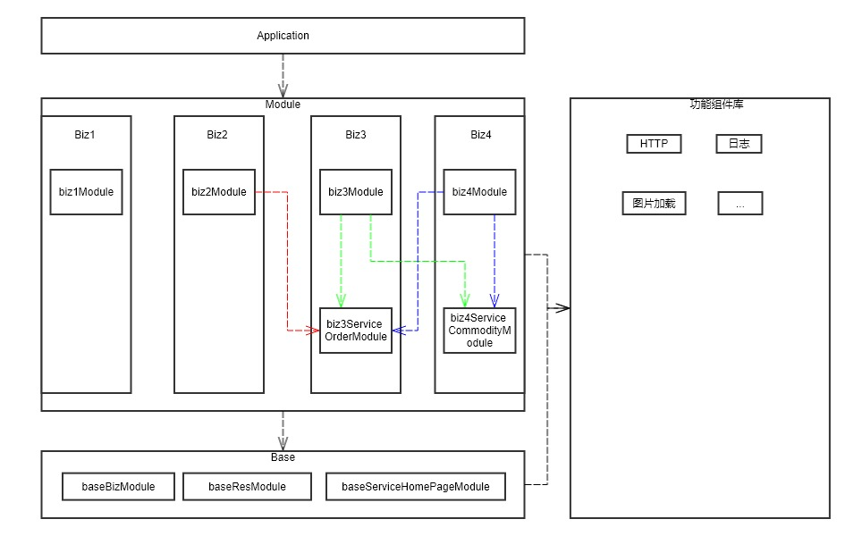

# Android SPI Demo

本项目是 Android SPI 项目的一个 Demo ，同时也是一次对 Android 模块化的探索。


在我个人的理解中，模块化需要组件化的支撑。其中模块化是基于业务的拆分，组件化是基于功能的拆分。例如，对于一个电商类的应用来说，商品信息、购物车等功能属于模块化，HTTP 、图片加载等属于组件化。


一个项目进行组件化构建时，需要将所有的业务逻辑拆分为一个个独立的模块，并且以 Library 项目的形式展示。在开发阶段，每一个模块都有一个对应的空壳应用项目，用于进行该模块的开发；在打包阶段，每一个模块需要加入主项目的依赖，以实现将所有模块打包入主项目。


使用模块化构建项目时，一定会遇到两个问题：

1. 主项目怎么获取子模块中的实现类
2. 同级模块之间怎么交互


主项目获取子模块中的实现类的目的一般是为了实现各个模块的加载以及 Application 的生命周期的传递。随着业务的发展，单独业务逻辑的模块会越来越多，如果每增加一个模块，就需要在主项目中手写代码加载对应的模块将会是一件很麻烦的事情。


统计模块之间的交互主要就是页面的跳转和数据的传递。页面跳转可以通过隐式 Intent 实现，也可以使用三方的 router 类的库实现，而数据的传递则会引发更多的问题。更多的时候，为了扩展性和便利性，模块间传递数据时，更多的是使用 xml 、json 等格式化数据，这种做法有两个问题：1. 数据传递过程中，需要进行一次序列化和一次反序列化。2. 数据传递的双方将各自持有一个格式化数据对应的 Java Bean（字段相同，但是类名或者包名不同） 。倘若两个模块间直接传递 Java Bean 则不会出现以上两个问题，但是这个 Java Bean 由哪一个模块创建将会是一个很大的问题。1. 若由子模块创建，则若出现两个子模块相互传递数据的情况，则会出现循环依赖的问题，导致项目无法编译。2. 若由公共模块创建，则每两个子模块需要传递数据就需要公共模块添加代码，一则公共模块代码会越来越大，二则公共模块的开发人员需要听候子模块开发人员需求，不符合软件工程设计。


在微信团队发表的文章[微信Android架构历史](https://mp.weixin.qq.com/s/6Q818XA5FaHd7jJMFBG60w)中，提到了一种模块化的解决思路，我也是借鉴了微信团队的模块化的思路，写了 Android SPI 以实现上述两个问题的具体实现方案。同时为了验证这个解决方案，写了本项目加以验证。


```
android-spi-demo
├─Application
│  └─app
├─Base
│  ├─baseBizModule
│  ├─baseResModule
│  └─baseServiceHomePageModule
├─Biz1
│  ├─app
│  └─biz1Module
├─Biz2
│  ├─app
│  └─biz2Module
├─Biz3
│  ├─app
│  ├─biz3Module
│  └─biz3ServiceOrderModule
└─Biz4
    ├─app
    ├─biz4Module
    └─biz4ServiceCommodityModule
```




Application 项目为主项目，它包含一个空壳项目 app ，主要用以加载子模块在 ViewPager 中的展示。


Base 为公共模块，用以向所有的业务模块提供基础支持和全局的数据支持。它包含三个项目，其中  baseBizModule 向所有的子模块提供了 UserManager 类，用以获取用户信息；baseResModule 为公共模块，用以向所有的业务模块提供基础的资源文件和样式；baseServiceHomePageModule 是一个 Service 项目，用以获取所有的子模块的起始 Fragment ，所有的子模块都需要提供这个 Service 的具体实现。


Biz1 为一个具体的业务模块，它和其他业务模块没有任何交互，只依赖了 baseBizModule 中的 UserManager 。Biz1 中包含两个项目，其中 app 项目为 Biz1 模块单独的应用项目，它是一个空壳项目，仅生成应用，加载 Biz1 模块的页面，用于 Biz1 模块的单独开发；biz1Module 为 Biz1 具体的业务项目，所有 Biz1 的逻辑代码都在这里。


Biz2 为一个具体的业务模块，它依赖 Biz3 模块提供的 Order Service 。Biz2 中包含两个项目，其中 app 项目为 Biz2 模块单独的应用项目，它是一个空壳项目，仅生成应用，加载 Biz2 模块的页面，用于 Biz2 模块的单独开发；biz2Module 为 Biz2 具体的业务项目，所有 Biz2 的逻辑代码都在这里。


Biz3 为一个具体的业务模块，它依赖 Biz4 模块提供的 Commodity Service 。Biz3 中包含三个项目，其中 app 项目为 Biz3 模块单独的应用项目，它是一个空壳项目，仅生成应用，加载 Biz3 模块的页面，用于 Biz3 模块的单独开发；biz3Module 为 Biz3 具体的业务项目，所有 Biz3 的逻辑代码都在这里；biz3ServiceOrderModule 为 Biz3 向外提供的 Order Service 项目，它包含了这个 Service 的定义和相关的 Java Bean 。


Biz4 为一个具体的业务模块，它依赖 Biz3 模块提供的 Order Service 。Biz4 中包含三个项目，其中 app 项目为 Biz4 模块单独的应用项目，它是一个空壳项目，仅生成应用，加载 biz4 模块的页面，用于 Biz4 模块的单独开发；biz4Module 为 biz4 具体的业务项目，所有 Biz4 的逻辑代码都在这里。biz4ServiceCommodityModule 为 Biz4 向外提供的 Commodity Service 项目，它包含了这个 Service 的定义和相关的 Java Bean 。


其中，Application 的 app 项目、Biz1 的 app 项目、Biz2 的 app 项目、Biz3 的 app 项目、Biz4 的 app 项目均可以独立运行，也可以通过模块的组装生成新的应用。
